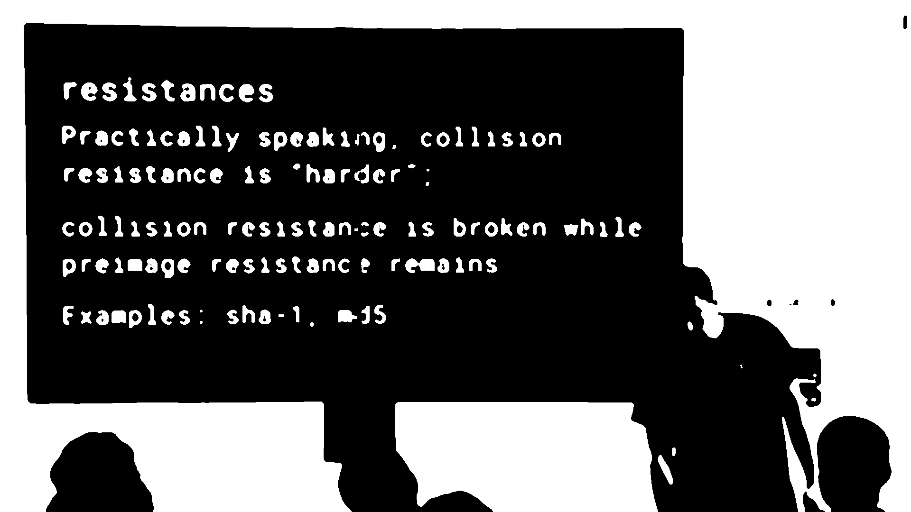
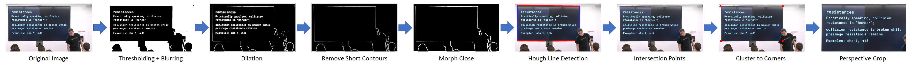
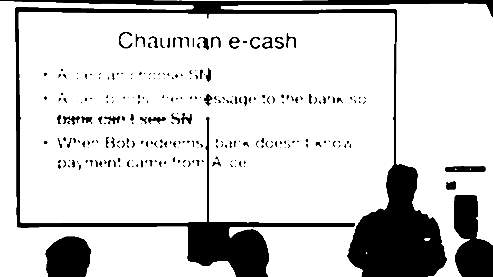
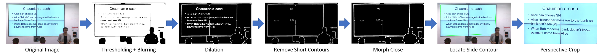

.. _corner_crop_transform:

Perspective Cropping & Corner Detection
=======================================

The corner crop transform algorithm has two steps. First, it will apply Ostu's threshold and extract contours from an edge map of the image. In the edge map, the algorithm attempts to find a large rectangle, which is the slide. This method is ineffective if there are any gaps or obstructions in the outline around the slide. So, if it fails to find the slide, the program will use the Hough Lines algorithm to find horizontal and vertical lines, then find the intersection points, and finally cluster those points using KMeans.

The process this file executes is based on `this jupyter notebook <https://github.com/Breta01/handwriting-ocr/blob/master/notebooks/page_detection.ipynb>`_ and `this StackOverflow answer <https://stackoverflow.com/a/44454619>`_. The `opencv package <https://docs.opencv.org/4.3.0/index.html>`_ provides most of the low-level functions. See the :ref:`Corner Crop Transform API Documentation <e2e_api_corner_crop_transform>` for details regarding the functions.

Useful guides and tutorials to help understand the script:
    * `How To Build a Kick-Ass Mobile Document Scanner in Just 5 Minutes <https://www.pyimagesearch.com/2014/09/01/build-kick-ass-mobile-document-scanner-just-5-minutes/>`_
    * `Credit card OCR with OpenCV and Python <https://www.pyimagesearch.com/2017/07/17/credit-card-ocr-with-opencv-and-python/>`_
    * `A Box detection algorithm for any image containing boxes. <https://medium.com/coinmonks/a-box-detection-algorithm-for-any-image-containing-boxes-756c15d7ed26>`_
    * `Sorting Contours using Python and OpenCV <https://www.pyimagesearch.com/2015/04/20/sorting-contours-using-python-and-opencv/>`_
    * `Horizontal Line detection with OpenCV <https://stackoverflow.com/a/7228823>`_
    * `Text skew correction with OpenCV and Python <https://www.pyimagesearch.com/2017/02/20/text-skew-correction-opencv-python/>`_

Debug/Testing Mode
------------------

The file can be run as a script in order to try the image processing pipeline on several files, view the results, and tweak the parameters as necessary to improve accuracy.

Recommended Command:

.. code-block:: bash

    python corner_crop_transform.py folder ../presenter_slide/ --debug_mode --debug_gif --debug_path ../debug_imgs

The above command processes all files in the ``../presenter_slide/`` folder. The ``--debug_mode`` argument allows the usage of ``--debug_gif`` and ``--debug_path``. ``--debug_gif`` will save a gif of each step of the pipeline with a 1.4s delay to ``--debug_path``. ``--debug_imgs`` can also be enabled to save each step of the pipeline as its own image (in higher quality than the GIF, the GIF only has 256 colors).

Using ``--debug_mode`` will output a file in the present working directory named ``debug_crop_error_log.txt`` with the paths to all of the images that the pipeline thinks it failed with.

.. warning:: There may be other images that the script failed to process correctly. The ``debug_crop_error_log.txt`` file only contains the paths to images that did not meet the criteria to be perspective cropped. The reasoning behind why they didn't will likely lead to parameter tuning.

You can also process a single file using the file as a script with the ``file`` mode:

.. code-block:: bash

    python corner_crop_transform.py file /path/to/image/file/0Q5IimX-AAc-img_067.jpg -d -di -dg

Example Images
--------------

Example of ``contours`` mode failing and falling back to ``hough_lines``
^^^^^^^^^^^^^^^^^^^^^^^^^^^^^^^^^^^^^^^^^^^^^^^^^^^^^^^^^^^^^^^^^^^^^^^^

Command used to create above image:

.. code-block:: bash

    python corner_crop_transform.py file ../dataset/classifier-data/presenter_slide/IJquEYhiq_U-img_130_debug.gif -d -di -dg -dgo

Timeline of images (click image for larger view):

Example of ``contours`` mode succeeding
^^^^^^^^^^^^^^^^^^^^^^^^^^^^^^^^^^^^^^^

Command used to create above image:

.. code-block:: bash

    python corner_crop_transform.py file ../dataset/classifier-data/presenter_slide/IJquEYhiq_U-img_068.jpg -d -di -dg -dgo

Timeline of images (click image for larger view):

Script Help
-----------

Output of ``python corner_crop_transform.py --help``:

.. code-block:: bash

    usage: corner_crop_transform.py [-h] [-d] [-di] [-dg] [-dgo] [-p DEBUG_PATH]
                                [-l {DEBUG,INFO,WARNING,ERROR,CRITICAL}]
                                {file,folder} path

    Perspective Crop to Rectangles (Slides)

    positional arguments:
    {file,folder}         `file` mode will crop a single image and `folder` mode
                            will crop all the images in a given folder
    path                  path to file or folder (depending on `mode`) to
                            process

    optional arguments:
    -h, --help            show this help message and exit
    -d, --debug_mode      enable the usage of `--debug_imgs`, `--debug_gif`, and
                            `--debug_path`.
    -di, --debug_imgs     Save debug images (JPG of each step of the pipeline).
                            Requires `--debug_mode` to be enabled.
    -dg, --debug_gif      Save debug gif (GIF with 1.4s delay between each debug
                            image). Requires `--debug_mode` to be enabled.
    -dgo, --debug_gif_optimize
                            Optimize the gif produced by enabling --debug_gif with
                            `gifsicle`.
    -p DEBUG_PATH, --debug_path DEBUG_PATH
                            path to folder to store debug images (default:
                            './debug_imgs')
    -l {DEBUG,INFO,WARNING,ERROR,CRITICAL}, --log {DEBUG,INFO,WARNING,ERROR,CRITICAL}
                            Set the logging level (default: 'Info').
