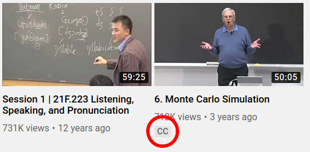

Transcribe (Speech-To-Text)
===============================

API Documentation: :ref:`e2e_api_transcribe`

The ``transcribe`` module contains the features necessary to convert a wave file to text.

There are 6 methods, which rely on 4 libraries, of transcribing audio implemented in this module. Additionally, 2 chunking algorithms are supported.

The mixed performance of :ref:`DeepSegment <deepsegment_description>` combined with the inaccuracies of current STT software results in subpar performance overall in the automatic creation of transcripts. Ideally, the user will provide a transcript. If not, then summarization methods that use the transcript will be negatively impacted since summarization models rely on correct grammatical structures.

Chunking
--------

Chunking increases speed of voice-to-text by reducing the amount of audio without speech.

* **Voice Activity:** Uses the WebRTC Voice Activity Detector (VAD) which is "reportedly one of the best VADs available, being fast, modern, and free." The python bindings to the WebRTC VAD API are provided by `wiseman/py-webrtcvad <https://github.com/wiseman/py-webrtcvad>`_. This algorithm is implemented in the :meth:`~lecture2notes.end_to_end.transcribe.transcribe_main.chunk_by_speech` function. It produces ``segments`` that can be transcribed with :meth:`~lecture2notes.end_to_end.transcribe.transcribe_main.process_segments` using `DeepSpeech <https://github.com/mozilla/DeepSpeech>`_, `Vosk <https://alphacephei.com/vosk/>`_, or `Wav2Vec2 <https://huggingface.co/transformers/model_doc/wav2vec2.html>`_.
* **Noise Activity:** Detects and removes segments of audio that are significantly below the average loudness of the file. This algorithm is implemented in :meth:`~lecture2notes.end_to_end.transcribe.transcribe_main.chunk_by_silence` and it writes ``chunks`` (wave files that are parts of the original file that contain noise) to disk. :meth:`~lecture2notes.end_to_end.transcribe.transcribe_main.process_chunks` runs transcription on every file in a directory. It can be used in conjunction with :meth:`~lecture2notes.end_to_end.transcribe.transcribe_main.chunk_by_silence` to transcribe all the ``chunks`` and return a merged transcript.

.. note:: Chunking is necessary for the ``google`` method (see :ref:`transcribe_methods`) for long audio files since Google Speech Recognition will time out if the file size is too large.

.. _transcribe_methods:

Transcribing Methods
--------------------

.. note:: Throughout this section ``google`` refers to "Google Speech Recognition" (free) and not the `Google Cloud Speech API <https://cloud.google.com/speech/>`_ (paid). It is my understanding that "Google Speech Recognition" is deprecated and could disappear anytime. "Google Speech Recognition" was not tested but the "Google Cloud Speech API" was tested so in the results "Google STT" refers to the paid "Google Cloud Speech API."

The recommended method is Vosk (small model) since it works offline (``google`` does not), has fantastic accuracy (1st or 2nd best depending on model used), is actively maintained (``sphinx`` and ``google`` are dated), is completely open source (``google`` is proprietary), is the most reliable (``google`` frequently times out and ``sphinx`` is difficult to work with), and doesn't require a GPU (DeepSpeech does utilize a GPU). To download the recommended model run the commands under :ref:`transcribe_method_vosk`.

You can specify the transcription method you like using the ``--transcription_method`` option with the ``end_to_end/main.py`` script. Some methods require a model to be loaded. For those methods you should set the ``--transcribe_model_dir`` to the directory containing the model. For example, the default is to use the Vosk small model so the ``--transcription_method`` defaults to ``vosk`` and the ``--transcribe_model_dir`` defaults to ``./vosk-models/vosk-model-en-us-small-0.3/``.

1. YouTube
^^^^^^^^^^
:meth:`lecture2notes.transcribe.transcribe_main.get_youtube_transcript`. This method only works if the lecture to be summarized is a YouTube video that contains manually added captions.

    You can tell if a video contains manual captions if it contains the CC icon as shown above.

This method downloads the transcript for the specified language directly from YouTube using either the YouTube API (:meth:`~lecture2notes.end_to_end.transcript_downloader.TranscriptDownloader.get_transcript_api`) or ``youtube-dl`` (:meth:`~lecture2notes.end_to_end.transcript_downloader.TranscriptDownloader.get_transcript_ytdl`). Both methods are part of the :class:`~lecture2notes.end_to_end.transcript_downloader.TranscriptDownloader` class.

The :meth:`~lecture2notes.end_to_end.transcript_downloader.TranscriptDownloader.download` function provides easy access to both of these download options.

.. note:: The YouTube API requires an API key. You can find more information about how to obtain a key for free from `Google Developers <https://developers.google.com/youtube/registering_an_application>`_.

.. important:: Using ``youtube-dl`` is recommended over the YouTube API because it does not require an API key and is significantly more reliable than the YouTube API.

2. General: Sphinx and Google
^^^^^^^^^^^^^^^^^^^^^^^^^^^^^

The ``sphinx`` and ``google`` methods use the `SpeechRecognition library <https://pypi.org/project/SpeechRecognition/>`_ to access ``pockersphinx-python`` and Google Speech Recognition, respectively. These methods are grouped together in the :meth:`~lecture2notes.transcribe.transcribe_main.transcribe_audio_generic` function because the SpeechRecognition library simplifies the differences to one line. The ``method`` argument allows the switching between both methods.

3. DeepSpeech
^^^^^^^^^^^^^

The ``deepspeech`` method uses the `Mozilla DeepSpeech <https://github.com/mozilla/DeepSpeech>`_ library, which achieves very good accuracy on the `LibriSpeech clean test corpus <https://www.openslr.org/12>`_ (the current model accuracy can be found on the `latest release page <https://github.com/mozilla/DeepSpeech/releases/latest>`_.

The DeepSpeech architecture was created by *Baidu* in 2014. Project DeepSpeech was created by *Mozilla* (the creators of the popular Firefox web browser) to provide the open source community with an updated Speech-To-Text engine.

In order to use this method in the ``end_to_end/main.py`` script, the latest DeepSpeech model needs to be downloaded (the ``.pbmm`` acoustic model and the scorer) from the `releases page <https://github.com/mozilla/DeepSpeech/releases>`_. Mozilla provides code to download and extract the model on the `project's documentation <https://deepspeech.readthedocs.io/en/latest/USING.html#getting-the-pre-trained-model>`_. You can rename these files as long as the extensions remain the same. When using the ``end_to_end/main.py`` script you only have to specify the directory containing both files (the directory name is not important but `deepspeech-models` is descriptive). See :ref:`install` for more details about downloading the deepspeech models.

Example Folder Structure:

.. code-block:: bash

    deepspeech-models/
    ├── deepspeech-0.7.1-models.pbmm
    ├── deepspeech-0.7.1-models.scorer

.. _transcribe_method_vosk:

4. Vosk
^^^^^^^

The ``vosk`` method is implemented in the :meth:`~lecture2notes.transcribe.transcribe_main.transcribe_audio_vosk` function. It uses the `vosk library <https://pypi.org/project/vosk/>`_.

In order to use this method in the ``end_to_end/main.py`` script, you need to download one of the models from alphacephei's website at https://alphacephei.com/vosk/models (`Google Drive Mirror <https://drive.google.com/drive/folders/10OY4DeD3Lm-hdTFLFDvaDYaL2m-8h-Cr>`__).

These commands will download the recommended model and put it in the expected location:

.. code-block:: bash

    conda activate lecture2notes
    gdown https://drive.google.com/uc?id=1cjgVxc_NJUYapxEJ2xv-t61nKhJhKs-M
    unzip vosk-model-en-us-small-0.3.zip
    mkdir vosk-models/
    mv vosk-model-en-us-small-0.3 ./vosk-models/vosk-model-en-us-small-0.3/

5. Wave2Vec2
^^^^^^^^^^^^

The Wav2Vec2 model was proposed in `wav2vec 2.0: A Framework for Self-Supervised Learning of Speech Representations <https://arxiv.org/abs/2006.11477>`_ by Alexei Baevski, Henry Zhou, Abdelrahman Mohamed, and Michael Auli.

The abstract from the paper is the following:

"We show for the first time that learning powerful representations from speech audio alone followed by fine-tuning on transcribed speech can outperform the best semi-supervised methods while being conceptually simpler. wav2vec 2.0 masks the speech input in the latent space and solves a contrastive task defined over a quantization of the latent representations which are jointly learned. Experiments using all labeled data of Librispeech achieve 1.8/3.3 WER on the clean/other test sets. When lowering the amount of labeled data to one hour, wav2vec 2.0 outperforms the previous state of the art on the 100 hour subset while using 100 times less labeled data. Using just ten minutes of labeled data and pre-training on 53k hours of unlabeled data still achieves 4.8/8.2 WER. This demonstrates the feasibility of speech recognition with limited amounts of labeled data."

The implementation in lecture2notes uses the `huggingface/transformers package <https://huggingface.co/transformers/model_doc/wav2vec2.html>`__. You can learn more by reading the code for the :meth:`~lecture2notes.transcribe.transcribe_main.transcribe_audio_wav2vec` function. The wav2vec2 model will automatically be downloading upon usage thanks to huggingface/transformers. The default model key to be downloaded from the `model hub <https://huggingface.co/facebook/wav2vec2-base-960h>`__ is ``facebook/wav2vec2-base-960h``. You can also download the model manually from `this Google Drive mirror <https://drive.google.com/uc?id=1FAkQ8GgmXY3dfyXTeUmi98K6Cb6f40wQ>`__

Experiment Results
------------------

We tested the performance of DeepSpeech, Sphinx, several Vosk models, and Google's paid STT API on 43 lecture videos from the slide classifier dataset. These videos were from MIT OpenCourseWare and had human-written transcripts attached. We used the YouTube API to fetch the transcripts. We then computed the Word Error Rate (WER), Match Error Rate (MER), and Word Information Lost (WIL). The tests were performed on an Intel i7-6700HQ CPU and a Mobile Nvidia GTX-1060-6GB GPU.

+------------------------------+-------+-------+-------+------------------+-------------------+
| Model                        | WER   | MER   | WIL   | LS TC WER [#f1]_ | Processing Time   |
+==============================+=======+=======+=======+==================+===================+
| DeepSpeech (chunking)        | 43.01 | 41.82 | 59.04 | 5.97             | 4 hours           |
+------------------------------+-------+-------+-------+------------------+-------------------+
| DeepSpeech                   | 44.44 | 42.98 | 59.99 | 5.97             | 20 hours          |
+------------------------------+-------+-------+-------+------------------+-------------------+
| Google STT ("default" model) | 34.43 | 33.14 | 49.05 | 12.23            | 20 minutes [#f2]_ |
+------------------------------+-------+-------+-------+------------------+-------------------+
| Wav2Vec2                     | 39.38 | 36.27 | 54.43 | 2.60             | 40 minutes        |
+------------------------------+-------+-------+-------+------------------+-------------------+
| Sphinx was not tested because it is between 6x-18x slower than other models.                |
+------------------------------+-------+-------+-------+------------------+-------------------+
| Vosk small-0.3               | 35.43 | 33.64 | 50.84 | 15.34            | 8.5 hours         |
+------------------------------+-------+-------+-------+------------------+-------------------+
| Vosk daanzu-20200905         | 33.67 | 31.87 | 48.28 | 7.08             | 5.5 hours         |
+------------------------------+-------+-------+-------+------------------+-------------------+
| Vosk aspire-0.2              | 41.38 | 38.44 | 56.35 | 13.64            | 19 hours          |
+------------------------------+-------+-------+-------+------------------+-------------------+
| Vosk aspire-0.2 (chunking)   | 41.45 | 38.65 | 56.56 | 13.64            | 19 hours          |
+------------------------------+-------+-------+-------+------------------+-------------------+

The WER on our test set of lecture audio recordings is much higher than the LibriSpeech baseline. This is because LibriSpeech contains clean audio recorded by professional microphones while most lecture recordings do not have access to this type of equipment. The ``Vosk small-0.3`` model is the smallest model and the ``Vosk daanzu-20200905`` model is both the fastest and most accurate model. Of the open-source models we tested, DeepSpeech and Wav2Vec2 are only ones that run on the GPU, which restricts the environments in which they can be used. Chunking is a necessity with the DeepSpeech model because it results in a 6.67x improvement in speed and about 1.4 percentage point decrease in WER.

Google's STT model was able to perform about 20\% better than DeepSpeech (measured by WER) but was still 0.76 percentage points behind ``Vosk daanzu-20200905``. Google's STT model was able to run much faster than any open-source model because multiple files were processed simultaneously. However, Google's services are proprietary and cost money while DeepSpeech, Sphinx, and Vosk are open-source, free, and, in some cases, more accurate. The open-source models can be parallelized, but were not for the sake of simplicity.

Despite its size, the ``Vosk small-0.3`` model is the second most accurate (measured by WER) out of the open-source models. This model ran about 2x faster than both DeepSpeech and the ``Vosk aspire-0.2` model. The ``Vosk small-0.3`` model is only 1.00 and 1.76 percentage points worse than Google's STT service and ``Vosk daanzu-20200905`` respectively. Chunking does not improve the performance or speed of Vosk because it is meant for streaming ASR instead of transcribing an entire audio file.

.. rubric:: Footnotes

.. [#f1] "LS TC WER" stands for LibriSpeech test-clean WER (Word Error Rate).
.. [#f2] Google STT ran in parallel.

Script Descriptions
-------------------

* **transcribe_main**: Implements transcription using 6 different methods from 4 libraries and other miscellaneous functions related to audio transcription, including audio reading, writing, extraction, and conversion.
* **webrtcvad_utils**: Implements functions to filter out non-voiced sections from audio files. The primary function is :meth:`~lecture2notes.transcribe.webrtcvad_utils.vad_segment_generator`, which accepts an audio path and returns segments of audio with voice.
* **mic_vad_streaming**: Streams from microphone to DeepSpeech, using Voice Activity Detection (VAD) provided by ``webrtcvad``. This is essentially the `example file <https://github.com/mozilla/DeepSpeech-examples/blob/r0.7/mic_vad_streaming/mic_vad_streaming.py>`_ from `mozilla/DeepSpeech-examples <https://github.com/mozilla/DeepSpeech-examples>`_.
    * To select the correct input device, the code below can be used. It will print a list of devices and associated parameters as detected by ``pyaudio``.

    .. code-block:: bash

        import pyaudio
        p = pyaudio.PyAudio()
        for i in range(p.get_device_count()):
            print(p.get_device_info_by_index(i))

    * Output of ``python mic_vad_streaming.py --help``

    .. code-block:: bash

        usage: mic_vad_streaming.py [-h] [-v VAD_AGGRESSIVENESS] [--nospinner]
                                    [-w SAVEWAV] [-f FILE] -m MODEL [-s SCORER]
                                    [-d DEVICE] [-r RATE]

        Stream from microphone to DeepSpeech using VAD

        optional arguments:
        -h, --help            show this help message and exit
        -v VAD_AGGRESSIVENESS, --vad_aggressiveness VAD_AGGRESSIVENESS
                                Set aggressiveness of VAD: an integer between 0 and 3,
                                0 being the least aggressive about filtering out non-
                                speech, 3 the most aggressive. Default: 3
        --nospinner           Disable spinner
        -w SAVEWAV, --savewav SAVEWAV
                                Save .wav files of utterences to given directory
        -f FILE, --file FILE  Read from .wav file instead of microphone
        -m MODEL, --model MODEL
                                Path to the model (protocol buffer binary file, or
                                entire directory containing all standard-named files
                                for model)
        -s SCORER, --scorer SCORER
                                Path to the external scorer file.
        -d DEVICE, --device DEVICE
                                Device input index (Int) as listed by
                                pyaudio.PyAudio.get_device_info_by_index(). If not
                                provided, falls back to PyAudio.get_default_device().
        -r RATE, --rate RATE  Input device sample rate. Default: 16000. Your device
                                may require 44100.

.. _deepsegment_description:

DeepSegment
-----------

Some STT engines do not add punctuation. To solve this we use the `DeepSegment <https://github.com/notAI-tech/deepsegment>`_ model to segment sentences. This model restores sentence punctuation by only using the unpunctuated text as the input. A more accurate model may be able to determine punctuation based on the input text and timings of each word. For example, a greater pause between two words may indicate a period. However, since improving STT was not the goal of this research, this was not attempted. DeepSegment achieves a 52.64 absolute accuracy score (number of correctly segmented texts divided by number of examples) on text with no punctuation while Spacy only reaches 11.76 and NLTK Punkt reaches 9.89.

.. _transcribe_other_options:

Other Transcription Options
---------------------------

These are some of my notes on other potential speech-to-text libraries that I never fully integrated into lecture2notes. This information may be outdated, but it is still useful to know about the other options that exist.

ESPnet
^^^^^^

`espnet/espnet <https://github.com/espnet/espnet>`_ is extremely promising but is very slow for some reason. The "ASR demo" can be found in the `main README <https://github.com/espnet/espnet#asr-demo>`_.

The ESPnet commands to transcribe a WAV file are:

.. code-block:: bash

    cd egs/librispeech/asr1
    . ./path.sh
    ./../../../utils/recog_wav.sh --ngpu 1 --models librispeech.transformer.v1 example.wav

Installation can be completed with:

.. code-block:: bash

    # OS setup
    !cat /etc/os-release
    !apt-get install -qq bc tree sox

    # espnet setup
    !git clone --depth 5 https://github.com/espnet/espnet
    !pip install -q torch==1.1
    !cd espnet; pip install -q -e .

    # download pre-compiled warp-ctc and kaldi tools
    !espnet/utils/download_from_google_drive.sh \
        "https://drive.google.com/open?id=13Y4tSygc8WtqzvAVGK_vRV9GlV7TRC0w" espnet/tools tar.gz > /dev/null
    !cd espnet/tools/warp-ctc/pytorch_binding && \
        pip install -U dist/warpctc_pytorch-0.1.1-cp36-cp36m-linux_x86_64.whl

    # make dummy activate
    !mkdir -p espnet/tools/venv/bin && touch espnet/tools/venv/bin/activate
    !echo "setup done."

wav2letter
^^^^^^^^^^

Wav2letter is an "open source speech processing toolkit" written in C++ that is "built to facilitate research in end-to-end models for speech recognition." It contains pre-trained models, but the state-of-the-art models can not easily be used with the separate inference scripts. They need to be converted. The `inference tutorial <https://github.com/facebookresearch/wav2letter/wiki/Inference-Run-Examples>`_ is helpful, but it uses a smaller "example model" that does not reach state-of-the-art accuracy.

It is recommended to use wav2letter with docker due to the complex dependency tree.

The `simple_streaming_asr_example <https://github.com/facebookresearch/wav2letter/blob/master/inference/inference/examples/SimpleStreamingASRExample.cpp>`_ script can transcribe a WAV file when it is provided with the models.

The pre-trained SOTA models are `in this folder <https://github.com/facebookresearch/wav2letter/tree/master/recipes/models/sota/2019>`_ and are from the `"End-to-end ASR: from Supervised to Semi-Supervised Learning with Modern Architectures" <https://arxiv.org/abs/1911.08460>`_ paper.

This issue is currently open and disscusses the lack of clear instructions about how to use the SOTA models for inference: `Any example code using the new pretrained models <https://github.com/facebookresearch/wav2letter/issues/485>`_

It may be possible to use the ``streaming_convnets`` research models for inference if they are converted using `StreamingTDSModelConverter.cpp <https://github.com/facebookresearch/wav2letter/blob/master/tools/StreamingTDSModelConverter.cpp>`_, which has instruction `in this README <https://github.com/facebookresearch/wav2letter/tree/master/tools#streaming-tds-model-conversion-for-running-inference-pipeline>`_.
