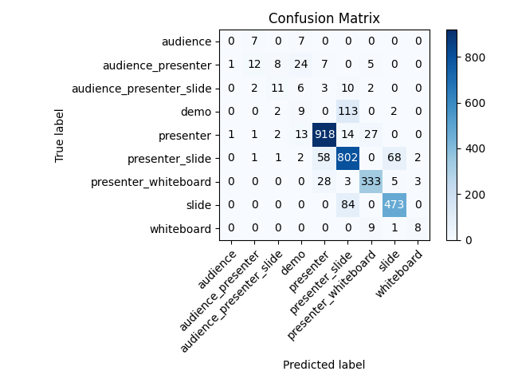
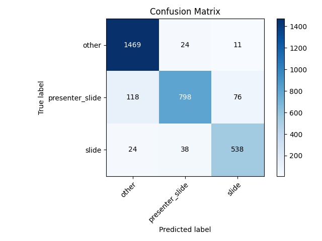

Slide Classifier
================

.. _sc_overview:

Overview
--------

The slide classification model is used in the end-to-end process to classify frames of an input video into 9 classes:

* audience
* audience_presenter
* audience_presenter_slide
* demo
* presenter
* presenter_slide
* presenter_whiteboard
* slide
* whiteboard

This allows the system to identify images containing slides for additional processing and means it can ignore useless frames that do not belong in a summary, such as those containing only the presenter or audience. We conduct preliminary tests with 7 architectures, but only report results from `ResNet <https://arxiv.org/abs/1512.03385>`_ and `EfficientNet <https://arxiv.org/abs/1905.11946>`_ models due to their superior accuracies.

.. important:: Interactive charts, graphs, raw data, run commands, hyperparameter choices, and more for all experiments are publicly available on the `Lecture2Notes-Slide_Classifier Weights & Biases page <https://app.wandb.ai/hhousen/lecture2notes-slide_classifier>`_.

.. _sc_pretrained_models:

Pre-trained Models
------------------

**Quick Start:** Use the ``three-category`` model trained on the ``train-test-three`` dataset. It achieves the highest accuracy (about 90%). Run ``gdown "https://drive.google.com/uc?id=1eXwWQujo_0HVffuUx0Fa6KydjW8h4gUb" -O lecture2notes/end_to_end/model_best.ckpt`` from the project root to download the model and put it in the default expected location.

+----------------+----------------------+-----------+------------------------------------------------------------------------------------------+----------------------------------------------------------------------------------------------------+
| Model          | Dataset              | Accuracy  | Model Download                                                                           | Other Checkpoints                                                                                  |
+================+======================+===========+==========================================================================================+====================================================================================================+
| Final-general  | ``train-test``       | 82.62     | `Google Drive Link <https://drive.google.com/uc?id=1tSbbehGTiW-ETODqysaYjB81-LiE6ddK>`__ | `Google Drive Folder <https://drive.google.com/drive/folders/1vQ9UcjYZnh54Fs3cBLZU8lKfFER4IlSC>`__ |
+----------------+----------------------+-----------+------------------------------------------------------------------------------------------+----------------------------------------------------------------------------------------------------+
| Three-category | ``train-test-three`` | **89.97** | `Google Drive Link <https://drive.google.com/uc?id=1eXwWQujo_0HVffuUx0Fa6KydjW8h4gUb>`__ | `Google Drive Folder <https://drive.google.com/drive/folders/1585XzlM0CWZHEwNNzvC5DnqP9F1C4NWt>`__ |
+----------------+----------------------+-----------+------------------------------------------------------------------------------------------+----------------------------------------------------------------------------------------------------+
| Squished-image | ``train-test``       | 83.86     | `Google Drive Link <https://drive.google.com/uc?id=1wg6zNd_LJyfP-Nk1DPLgS9YR47HNkL2V>`__ | `Google Drive Folder <https://drive.google.com/drive/folders/1NGapZ_sNkuxwIjvbangLnes4WGmZzlp4>`__ |
|                +----------------------+-----------+------------------------------------------------------------------------------------------+----------------------------------------------------------------------------------------------------+
|                | ``train-test-three`` | 87.21     | `Google Drive Link <https://drive.google.com/uc?id=1qEqvAFRSmVNEl4hSaNgztGUUg8J-it6J>`__ | `Google Drive Folder <https://drive.google.com/drive/folders/17W75GkXXxxBkZtkG9CplStowcRApsCIs>`__ |
+----------------+----------------------+-----------+------------------------------------------------------------------------------------------+----------------------------------------------------------------------------------------------------+

The median models (**recommended**) listed above can also be found on the `Lecture2Notes-Slide_Classifier Weights & Biases page <https://app.wandb.ai/hhousen/lecture2notes-slide_classifier>`_  or from `this Google Drive folder <https://drive.google.com/drive/folders/1jgUB6UmD-o9Xpf9Rs64tcsJJtHy32B2O>`__.

Every model that was trained for the experiments is available from the `Lecture2Notes-Slide_Classifier Weights & Biases page <https://app.wandb.ai/hhousen/lecture2notes-slide_classifier>`_ or from `this Google Drive mirror <https://drive.google.com/drive/folders/1qZuJGgMX2DFskKM0s3SJ_6IJEUmRNx8D>`__.

Model Architecture
------------------

After testing several architectures, we chose ResNet-34 as our final model architecture due to its speed, accuracy, and size. We started training all models from ImageNet pre-trained checkpoints and only perform gradient updates on the last chunk of layers (the pooling and fully connected linear layers shown below). We modified the architectures by changing the last chunk to enable better fine-tuning:

1. **ResNet**: ``AdaptiveConcatPool2d(1)``, ``Flatten()``, ``BatchNorm1d(1024)``, ``Dropout(0.25)``, ``Linear(1024, 512)``, ``ReLU(inplace=True)``, ``BatchNorm1d(512)``, ``Dropout(0.5)``, ``Linear(512, num_classes)``
2. **EfficientNet**: ``AdaptiveConcatPool2d(1)``, ``Flatten()``, ``Linear(num_features * 2, 512)``, ``MemoryEfficientSwish()``, ``BatchNorm1d(512)``, ``Dropout(0.5)``, ``Linear(512, num_classes)``

Model Training Approach
-----------------------

We performed 3-fold cross validation (CV) in order to optimize the slide classifier's hyperparameters. We used the Tree-structured Parzen Estimator algorithm provided by `Optuna <https://github.com/optuna/optuna>`_. All important hyperparameters were optimized, including model selection between a ResNet-34 and an EfficientNet-b0.

We implemented CV by splitting the :ref:`dataset <dataset_general_information>` into 3 roughly equal sections containing 5502, 5040, and 5057 frames respectively. The hyperparameter optimization algorithm optimizes the average accuracy across the validation sets for each CV split. The accuracy on the validation set is used instead of the training set to make sure the model does not memorize specific characteristics of the images that it is trained on. Accuracy is optimized as opposed to f1-score because f1-score takes into account class imbalance. For this model, the ``slide`` and ``presenter_slide`` classes are the two largest and also are the only classes used in the rest of the lecture summarization pipeline. If the model fails to correctly classify frames into the other categories there will be no impact on the final summary. These additional categories were included to allow for future research without having to relabel the data. For instance, the ``whiteboard`` class can be used in the future to extract handwritten text and drawing from a whiteboard to be added to notes.

Once the best hyperparameters were determined, we split the original dataset into training and testing sets (the ``train-test`` dataset) and retrained the model with the best hyperparameters. We did not simply copy the model checkpoint that reached the highest accuracy during the hyperparameter optimization process because splitting the dataset again allows us to train the model on 80\% of the data instead of 67\%. To create the testing set we selected a subset of videos that account for about 20\% (by the number of videos not frames) of the complete dataset. This subset minimizes the deviation of the testing set percentage (items in the testing set divided by total items in category) from 20\% for each category. We tested 10 million combinations of videos and obtained an average deviation of 0.0929, which equates to the following testing set percentages: slide=0.186, whiteboard=0.101, audience_presenter=0.201, presenter_whiteboard=0.205, presenter_slide=0.188, audience_presenter_slide=0.194, demo=0.294, presenter=0.208, audience=0.304. Selecting a random subset was not used because it could have resulted in class imbalance between the two datasets, thus offsetting the results. Therefore, there are 16 videos (3088 frames) and 62 videos (12511 frames) in the testing and training sets respectively.

Since only the ``slide`` and ``presenter_slide`` classes are used in the end-to-end process, we trained a separate model with those classes and an ``other`` class containing the remaining frames. We created a ``train-test-three`` dataset with these three categories using the same splitting approach that was used to create the ``train-test`` dataset. The average deviation was 0.001104 after 156 million combinations, which equates to the following testing set percentages: slide=0.200, presenter_slide=0.200, other=0.197.

Since pre-trained ImageNet CNNs accept square images, but video frames typically have an aspect ratio of 16:9, we center crop the data to a square and then scale to the correct dimensions for the ``train-test`` and ``train-test-three`` datasets. However, this may remove important data. Thus, we train a model on both datasets using squished images created by simply rescaling the image to the correct dimensions. Models trained using squished images will learn squished features and thus will produce variable results on images with a proper aspect ratio.

.. _slide_classifier_results:

Results
-------

.. table:: Performance of the 4 model configurations on the testing set.

    +----------------+----------------------+-----------+------------------+---------+-----------+--------+
    | Model          | Dataset              | Accuracy  | Accuracy (train) | F-score | Precision | Recall |
    +================+======================+===========+==================+=========+===========+========+
    | Final-general  | ``train-test``       | 82.62     | 98.58            | 87.44   | 97.73     | 82.62  |
    +----------------+----------------------+-----------+------------------+---------+-----------+--------+
    | Three-category | ``train-test-three`` | **89.97** | 99.72            | 93.82   | 99.95     | 89.97  |
    +----------------+----------------------+-----------+------------------+---------+-----------+--------+
    | Squished-image | ``train-test``       | 83.86     | 97.16            | 88.16   | 97.72     | 83.86  |
    |                +----------------------+-----------+------------------+---------+-----------+--------+
    |                | ``train-test-three`` | 87.21     | 100.00           | 91.57   | 99.80     | 87.21  |
    +----------------+----------------------+-----------+------------------+---------+-----------+--------+

After training 262 models for a total of 94 trials during CV, the highest average accuracy of 85.42\% was achieved by a ResNet-34 model after training for 9 epochs with the following hyperparameters: batch_size=64, learning_rate=0.00478, momentum=0.952, weight_decay=0.00385, adamw_alpha=0.994, adamw_eps=4.53e-07, scheduler=onecycle.

.. table:: Classification report for median (by accuracy) non-squished **final-general** model

    +--------------------------+-----------+--------+----------+---------+
    | Class Name               | Precision | Recall | F1-Score | Support |
    +==========================+===========+========+==========+=========+
    | audience                 | 0.00      | 0.00   | 0.00     | 14      |
    +--------------------------+-----------+--------+----------+---------+
    | audience_presenter       | 0.52      | 0.21   | 0.30     | 57      |
    +--------------------------+-----------+--------+----------+---------+
    | audience_presenter_slide | 0.46      | 0.32   | 0.38     | 34      |
    +--------------------------+-----------+--------+----------+---------+
    | demo                     | 0.15      | 0.07   | 0.10     | 126     |
    +--------------------------+-----------+--------+----------+---------+
    | presenter                | 0.91      | 0.94   | 0.92     | 976     |
    +--------------------------+-----------+--------+----------+---------+
    | presenter_slide          | 0.78      | 0.86   | 0.82     | 934     |
    +--------------------------+-----------+--------+----------+---------+
    | presenter_whiteboard     | 0.89      | 0.90   | 0.89     | 372     |
    +--------------------------+-----------+--------+----------+---------+
    | slide                    | 0.86      | 0.85   | 0.86     | 557     |
    +--------------------------+-----------+--------+----------+---------+
    | whiteboard               | 0.62      | 0.44   | 0.52     | 18      |
    +--------------------------+-----------+--------+----------+---------+
    | accuracy                 | --        | --     | 0.83     | 3088    |
    +--------------------------+-----------+--------+----------+---------+
    | macro avg                | 0.58      | 0.51   | 0.53     | 3088    |
    +--------------------------+-----------+--------+----------+---------+
    | weighted avg             | 0.81      | 0.83   | 0.82     | 3088    |
    +--------------------------+-----------+--------+----------+---------+

.. table:: Classification report for median (by accuracy) non-squished **three-category** model

    +-----------------+-----------+--------+----------+---------+
    | Class Name      | Precision | Recall | F1-Score | Support |
    +=================+===========+========+==========+=========+
    | other           | 0.91      | 0.98   | 0.94     | 1504    |
    +-----------------+-----------+--------+----------+---------+
    | presenter_slide | 0.93      | 0.80   | 0.86     | 992     |
    +-----------------+-----------+--------+----------+---------+
    | slide           | 0.86      | 0.90   | 0.88     | 600     |
    +-----------------+-----------+--------+----------+---------+
    | accuracy        | --        | --     | 0.91     | 3096    |
    +-----------------+-----------+--------+----------+---------+
    | macro avg       | 0.90      | 0.89   | 0.89     | 3096    |
    +-----------------+-----------+--------+----------+---------+
    | weighted avg    | 0.91      | 0.91   | 0.90     | 3096    |
    +-----------------+-----------+--------+----------+---------+

For each of the 4 model configurations, we trained 11 models and report the average metrics in the tables and figures on this page.

The final-general model (trained on the ``train-test`` dataset with the best hyperparameters found) achieved an average accuracy of 82.62\%. About 15\% of the ``slide`` frames were incorrectly classified as ``presenter_slide``. About 14\% of the ``presenter_slide`` (of which 50\% were ``slide`` and 43\% were ``presenter``) frames were classified incorrectly. Incorrectly classifying ``slide`` frames as ``presenter_slide`` will have minimal impact on the final summary. Incorrectly classifying ``presenter_slide`` frames as ``slide`` will impact the final summary because they will not receive the correct processing. Incorrectly classifying ``presenter_slide`` as ``presenter`` represents a possible loss of information, but this is unlikely due to the same slide appearing in multiple frames.

    Final-general slide classification model confusion matrix

    Three-category slide classification model confusion matrix

The squished-image model (trained on the ``train-test`` dataset) slightly improves upon the results of the final-general mode by achieving an average accuracy of 83.86\%, an increase of 1.24 percentage points. The results of the three-category model (trained on the ``train-test-three`` dataset) give a better picture of real-world performance with an average accuracy of 89.97\%. Squishing the images when training on the ``train-test-three`` dataset does not appear to improve performance like it did with the ``train-test`` dataset. Training the squished-image model on the ``train-test-three`` dataset (squished-image-three model) yields an average accuracy of 87.21\%, a decrease of 2.76 percentage points from the three-category model. In the final pipeline, we use the three-category model.

Script Descriptions
-------------------

.. note:: Visit the :ref:`slide_classifier_api` page to see the documentation for each function in more detail.

* **class_cluster_scikit.py**: Implements ``KMeans`` and ``AffinityPropagation`` from ``sklearn.cluster`` to provide a :class:`lecture2notes.models.slide_classifier.class_cluster_scikit.Cluster` class. The code is documented in file. The purpose is to add feature vectors using ``add()``, then cluster the features, and finally return a list of files and their corresponding cluster centroids with :meth:`~lecture2notes.models.slide_classifier.class_cluster_scikit.Cluster.create_move_list`. Three important functions and their use cases follow:

    * :meth:`~lecture2notes.models.slide_classifier.class_cluster_scikit.Cluster.create_move_list` is called in :class:`lecture2notes.end_to_end.cluster.ClusterFilesystem` and returns a list of filenames and their corresponding clusters.
    * :meth:`~lecture2notes.models.slide_classifier.class_cluster_scikit.Cluster.calculate_best_k` generates a graph (saved to ``best_k_value.png`` if using Agg matplotlib backend) that graphs the cost (squared error) as a function of the number of centroids (value of k) if the algorithm is ``"kmeans"``. The point at which the graph becomes essentially linear is the optimal value of k.
    * :meth:`~lecture2notes.models.slide_classifier.class_cluster_scikit.Cluster.visualize` creates a tensorboard projection of the cluster for simplified viewing and understanding.

* **class_cluster_faiss.py**: An outdated version of **class_cluster_scikit** that uses `facebookresearch/faiss <https://github.com/facebookresearch/faiss>`_ (specifically the kmeans implementation `documented here <https://github.com/facebookresearch/faiss/wiki/Faiss-building-blocks:-clustering,-PCA,-quantization>`_) to provide a ``Cluster`` class. More details in the ``class_cluster_scikit`` entry above.
* **custom_nnmodules.py**: Provides a few custom (copied from `fastai <https://github.com/fastai/fastai>`_) nn.Modules.
* **inference.py**: Sets up model and provides ``get_prediction()``, which takes an image and returns a prediction and extracted features.
* **lr_finder.py**: Slightly modified (allows usage of matplotlib Agg backend) code from `davidtvs/pytorch-lr-finder <https://github.com/davidtvs/pytorch-lr-finder>`_ to find the best learning rate.
* **mish.py**: Code for the mish activation function.
* **slide-classifier-fastai.ipynb**: Notebook to train simple fastai classifier on the dataset in ``dataset/classifier-data``. It is outdated and not supported and only remains in the repository as an example.
* **slide_classifier_helpers.py**: Helper functions for ``slide_classifier_pytorch.py``. Includes RELU to Mish activation function conversion and confusion matrix plotting functions among others.
* **slide_classifier_pytorch.py**: The main model code which uses advanced features such as the AdamW optimizer and a modified ResNet that allows for more effective pre-training/feature extracting.
* **slide-classifier-pytorch-old.py**: The old version of the slide classifier model training code. This old version was not organized as well as the current version. The old version was raw PyTorch code since it did not utilize ``pytorch_lightning``.

Slide-Classifier-Pytorch Help
-----------------------------

Output of ``python slide_classifier_pytorch.py --help``:

.. code-block:: bash

    usage: slide_classifier_pytorch.py [-h] [--default_root_dir DEFAULT_ROOT_DIR]
                                        [--min_epochs MIN_EPOCHS]
                                        [--max_epochs MAX_EPOCHS]
                                        [--min_steps MIN_STEPS]
                                        [--max_steps MAX_STEPS] [--lr LR]
                                        [--check_val_every_n_epoch CHECK_VAL_EVERY_N_EPOCH]
                                        [--gpus GPUS] [--overfit_pct OVERFIT_PCT]
                                        [--train_percent_check TRAIN_PERCENT_CHECK]
                                        [--val_percent_check VAL_PERCENT_CHECK]
                                        [--test_percent_check TEST_PERCENT_CHECK]
                                        [--amp_level AMP_LEVEL]
                                        [--precision PRECISION] [--seed SEED]
                                        [--profiler]
                                        [--progress_bar_refresh_rate PROGRESS_BAR_REFRESH_RATE]
                                        [--num_sanity_val_steps NUM_SANITY_VAL_STEPS]
                                        [--use_logger {tensorboard,wandb}]
                                        [--do_train] [--do_test]
                                        [--load_weights LOAD_WEIGHTS]
                                        [--load_from_checkpoint LOAD_FROM_CHECKPOINT]
                                        [-l {DEBUG,INFO,WARNING,ERROR,CRITICAL}]
                                        [-a ARCH] [-j N]
                                        [--train_batch_size TRAIN_BATCH_SIZE]
                                        [--val_batch_size VAL_BATCH_SIZE]
                                        [--test_batch_size TEST_BATCH_SIZE]
                                        [--momentum M] [--weight_decay W] [-k K]
                                        [--optimizer_alpha N] [--optimizer_eps N]
                                        [--pretrained] [--random_split]
                                        [--relu_to_mish]
                                        [--feature_extract {normal,advanced,none}]
                                        [-o OPTIMIZER]
                                        DIR

        positional arguments:
        DIR                   path to dataset

        optional arguments:
        -h, --help            show this help message and exit
        --default_root_dir DEFAULT_ROOT_DIR
                                Default path for logs and weights
        --min_epochs MIN_EPOCHS
                                Limits training to a minimum number of epochs
        --max_epochs MAX_EPOCHS
                                Limits training to a max number number of epochs
        --min_steps MIN_STEPS
                                Limits training to a minimum number number of steps
        --max_steps MAX_STEPS
                                Limits training to a max number number of steps
        --lr LR, --learning_rate LR
                                initial learning rate
        --check_val_every_n_epoch CHECK_VAL_EVERY_N_EPOCH
                                Check val every n train epochs.
        --gpus GPUS           Number of GPUs to train on or Which GPUs to train on.
                                (default: -1 (all gpus))
        --overfit_pct OVERFIT_PCT
                                Uses this much data of all datasets (training,
                                validation, test). Useful for quickly debugging or
                                trying to overfit on purpose.
        --train_percent_check TRAIN_PERCENT_CHECK
                                How much of training dataset to check. Useful when
                                debugging or testing something that happens at the end
                                of an epoch.
        --val_percent_check VAL_PERCENT_CHECK
                                How much of validation dataset to check. Useful when
                                debugging or testing something that happens at the end
                                of an epoch.
        --test_percent_check TEST_PERCENT_CHECK
                                How much of test dataset to check.
        --amp_level AMP_LEVEL
                                The optimization level to use (O1, O2, etc…) for
                                16-bit GPU precision (using NVIDIA apex under the
                                hood).
        --precision PRECISION
                                Full precision (32), half precision (16). Can be used
                                on CPU, GPU or TPUs.
        --seed SEED           Seed for reproducible results. Can negatively impact
                                performace in some cases.
        --profiler            To profile individual steps during training and assist
                                in identifying bottlenecks.
        --progress_bar_refresh_rate PROGRESS_BAR_REFRESH_RATE
                                How often to refresh progress bar (in steps). In
                                notebooks, faster refresh rates (lower number) is
                                known to crash them because of their screen refresh
                                rates, so raise it to 50 or more.
        --num_sanity_val_steps NUM_SANITY_VAL_STEPS
                                Sanity check runs n batches of val before starting the
                                training routine. This catches any bugs in your
                                validation without having to wait for the first
                                validation check.
        --use_logger {tensorboard,wandb}
                                Which program to use for logging.
        --do_train            Run the training procedure.
        --do_test             Run the testing procedure.
        --load_weights LOAD_WEIGHTS
                                Loads the model weights from a given checkpoint
        --load_from_checkpoint LOAD_FROM_CHECKPOINT
                                Loads the model weights and hyperparameters from a
                                given checkpoint.
        -l {DEBUG,INFO,WARNING,ERROR,CRITICAL}, --log {DEBUG,INFO,WARNING,ERROR,CRITICAL}
                                Set the logging level (default: 'Info').
        -a ARCH, --arch ARCH  model architecture: alexnet | densenet121 |
                                densenet161 | densenet169 | densenet201 | googlenet |
                                inception_v3 | mnasnet0_5 | mnasnet0_75 | mnasnet1_0 |
                                mnasnet1_3 | mobilenet_v2 | resnet101 | resnet152 |
                                resnet18 | resnet34 | resnet50 | resnext101_32x8d |
                                resnext50_32x4d | shufflenet_v2_x0_5 |
                                shufflenet_v2_x1_0 | shufflenet_v2_x1_5 |
                                shufflenet_v2_x2_0 | squeezenet1_0 | squeezenet1_1 |
                                vgg11 | vgg11_bn | vgg13 | vgg13_bn | vgg16 | vgg16_bn
                                | vgg19 | vgg19_bn | wide_resnet101_2 |
                                wide_resnet50_2 | efficientnet-b0 | efficientnet-b1 |
                                efficientnet-b2 | efficientnet-b3 | efficientnet-b4 |
                                efficientnet-b5 | efficientnet-b6 (default: resnet34)
        -j N, --workers N     number of data loading workers (default: 4)
        --train_batch_size TRAIN_BATCH_SIZE
                                Batch size per GPU/CPU for training.
        --val_batch_size VAL_BATCH_SIZE
                                Batch size per GPU/CPU for evaluation.
        --test_batch_size TEST_BATCH_SIZE
                                Batch size per GPU/CPU for testing.
        --momentum M          momentum. Ranger optimizer suggests 0.95.
        --weight_decay W      weight decay (default: 1e-2)
        -k K, --ranger_k K    Ranger (LookAhead) optimizer k value (default: 6)
        --optimizer_alpha N   Optimizer alpha parameter (default: 0.999)
        --optimizer_eps N     Optimizer eps parameter (default: 1e-8)
        --pretrained          use pre-trained model
        --random_split        use random_split to create train and val set instead
                                of train and val folders
        --relu_to_mish        convert any relu activations to mish activations
        --feature_extract {normal,advanced,none}
                                If `False` or `None`, finetune the whole model. When
                                `normal`, only update the reshaped layer params. When
                                `advanced`, use fastai version of feature extracting
                                (add fancy group of layers and only update this group
                                and BatchNorm)
        -o OPTIMIZER, --optimizer OPTIMIZER
                                Optimizer to use (default=AdamW)
